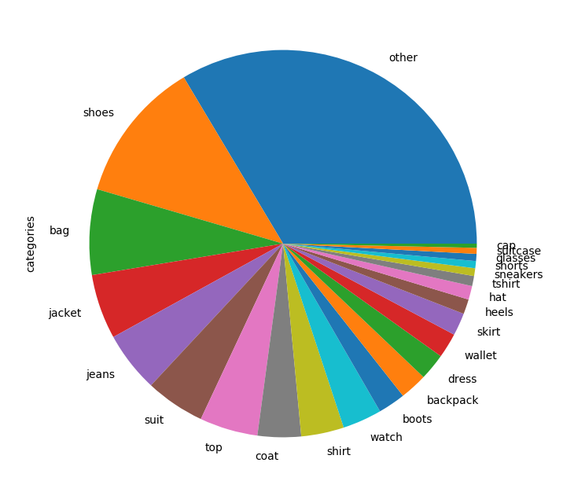
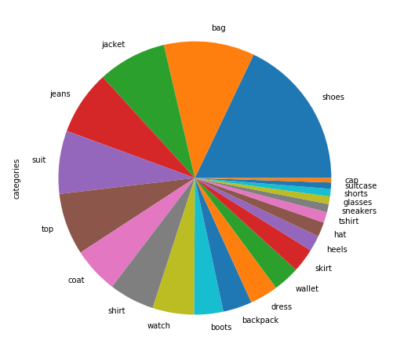

```{r setup, include=FALSE}
knitr::opts_chunk$set(echo = TRUE)
```

## 1. Context

Personalment volíem aportar un set de dades que servis per a entrenar models de classificació fent servir mètodes de visió per computador i que amb una mica de feina d'anotació es pogués fer servir en un futur per tasques de detecció i classificació d'objectes en una segona fase. Craigslist conté prou informació sobre els objectes que els usuaris posen a la venta i no té API a diferència d'altres opcions que vam contemplar com eBay, Yahoo! Auctions o wallapop, per tant ens va semblar ideal per a la realització d'aquesta pràctica. Volíem aportar categories d'algun camp amb el que la comunitat estigues treballant i craigslist contenia prou anuncis sobre roba i accessoris com per a poder tractar el tema. Després de decidir-nos pel *Deep Fashion* vam escollir Tòquio per tenir prou exemples de la categoria i a més a més aportar imatges fora de la Xina o el Estats Units que són dels països dels que normalment provenen els *datasets* que es fan servir actualment a la comunitat.

## 2. Títol del dataset

Hem escollit un títol descriptiu en anglès: *Clothing and Accessories Tokyo craigslist dataset* o CATCD.

## 3. Descripció del dataset

El *dataset* és un set de dades pensat per a que pugui fer-se servir principalment per desenvolupar models de reconeixement de roba i accessoris fent servir tècniques de *machine* o *deep learning*. Conté una filera per cada imatge descarregada d'un anunci a craigslist Tokyo a la categoria de *"clothing & accessories"*. Hem inclòs per aquesta finalitat les columnes que identifiquen la imatge, el títol original de l'anunci i una categoria a la que hem assignat cada grup o parell anunci-imatge. Ens ha semblat interessant també incloure el camp preu de l'anunci original ja que podria fer-se servir conjuntament amb l'estat de l'article o articles per a no únicament classificar les imatges, sinó, a més a més, extreure'n característiques com són el preu i l'estat de conservació. Finalment ens ha semblat convenient mantenir també el camp *neighborhood* per a poder també fer servir part del *dataset* per a confirmar si les diferències socioeconòmiques a les diferents àrees de la ciutat creen diferencies en el subconjunt de la població, majoritàriament estrangera, que fa servir craigslist a Tòquio encara que aquest no sigui l'objectiu principal de la creació del set de dades.

## 4. Representació gràfica

Presentem dos gràfics per a representar les dades. El primer és un diagrama de sectors que ens mostra quantes imatges hem obtingut de craigslist per categoria, incloent-hi la categoria *"other"* que hem fet servir per a catalogar les imatges que no han pogut ser assignades una categoria basant-nos en el títol dels seus anuncis.

```{r, out.width="65%"}

```

El següent gràfic és similar, però no inclou la categoria *"other"*, per tant podrem apreciar millor quantes imatges de les categories que ens interessaven hem aconseguit incloure al set de dades final.

```{r, out.width="65%"}

```

## 5. Contingut

Les dades es van recollir el dia 10 de novembre de 2019, entre les 15:00 i les 17:00 de la tarda. Van ser extretes de l'apartat *"clothing & accessories"* de la versió en anglès de craigslist *Tokyo*. Els camps inclosos són els següents:

1. post_id: identificador que hem assignat a l'anunci a craigslist.
2. post_title: títol original de l'anunci a craigslist.
3. price: preu del mateix.
4. neighborhood: barri o zona on es podria realitzar la venta.
5. condition: estat de conservació de l'objecte o objectes que es venen a l'anunci en qüestió.
6. image_id: identificador de la imatge dins l'anunci en qüestió, combinant post_id i image_id tenim un identificador únic.
7. uri: *path* a la imatge un cop es descomprimeix el zip amb les imatges a la carpeta /images.
8. category: categoria a la que hem assignat el contingut de l'anunci.

## 6. Agraïments

Les dades han estat extretes de craigslist, per tant agraïm a craigslist i als usuaris que van publicar els anuncis originals l'aportació de les dades per a la realització d'aquesta pràctica. Hem fet servir eines aportades per la comunitat com Python, Jupyter Notebook i les moltes llibreries fetes servir durant el desenvolupament d'aquesta pràctica com numpy, pandas, Beautiful Soup o imageio.

## 7. Inspiració

Aquesta pràctica està inspirada en l'explosió de l'anomenat *DeepFashion* d'ençà que The Chinese University of Hong Kong publiqués a l'any 2016 *"Fashion Landmark Detection in the Wild"*. Aquest *dataset* va ser un primer pas molt important per a impulsar l'estudi a camps com *Clothes Landmark Detection* o *Clothes Retrieval* i voliem aportar un petit set de dades que es pogués fer servir en alguns d'aquests camps.

## 8. Llicència

Ens hem decidir per la llicència següent: CC BY-NC-SA 4.0 License.

Els motius per escollir-la són els següents: nosaltres no som els propietaris de les imatges descarregades de craigslist per tant sembla més adient assignar una llicència no comercial; que permeti copiar, modificar, redistribuir i fer servir el set de dades com a base per entrenar tota mena de models de *machine learning* per motius educatius i no pas econòmics. 

## 9. Codi

El codi s'ha realitzat en Python 3 i està disponible als dos jupyter notebooks sota la carpeta *code*. El *notebook* craigslist-scraper.ipynb s'encarrega de realitzar l'*scraping* pròpiament dit, descarregarà les imatges i les col·locarà a la carpeta /images, també capturarà la resta d'informació rellevant de cada anunci i crearà un fitxer csv no definitiu amb ella que el següent *notebook*, text-post-processing, completarà. El csv final del *dataset* contindrà una columna extra que assignarà una categoria a cada imatge, aquesta categoria s'extraurà quan sigui possible del títol de l'anunci a craigslist.

## 10. Dataset

Es pot trobar el fitxer csv sota el nom "clothing_fashion_tokyo_dataset.csv" a la carpeta *csv*. Per descarregar les imatges cal seguir l'enllaç següent i disposar d'un compte gmail vinculat a la UOC: 

* https://drive.google.com/file/d/1FGjxPt1WK3jL1Fa7hce0AvtZ3GQThlMp/view?usp=sharing

__Referències:__

Aquest tutorial ens ajudarà a entendre com realitzar un *scraping* d'articles a la venta a craigslist:

* https://towardsdatascience.com/web-scraping-craigslist-a-complete-tutorial-c41cea4f4981

Aquesta pregunta a stackoverflow ens ajudarà a saber saber com accedir les imatges a descarregar fent servir una mida estàndard:

* https://stackoverflow.com/questions/56392436/scraping-each-image-from-a-craigslist-search
